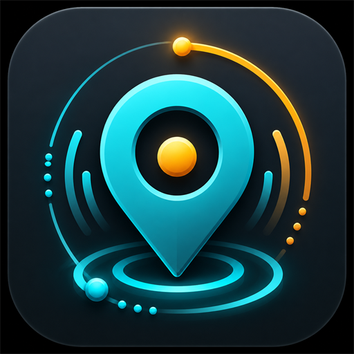

# Hotspot Animator

**Live web app:** https://ahmadmehri.github.io/hotspot-animator/

Turn a static hotspot icon into an eye-catching animated graphic for **3DVista** virtual tours and the web.

<p align="center">
  
</p>

Hotspot Animator is a desktop-style tool for virtual-tour creators. Import an image, pick from 60+ animation styles, fine-tune the motion, preview it live, and export an **APNG** (or WebP / GIF / WebM / a 3DVista drag-rotate package) with full transparency — ready to drop into a tour as a hotspot graphic.

It comes in **two flavors that share the same engine**:

| | Web app | Windows desktop app |
|---|---|---|
| Run | In the browser (online, or `npm run dev`) | Native `.exe` — installer or portable |
| Best for | Quick use, any OS, nothing to install | Offline use, native file/folder dialogs |
| Source | `src/` (React + TypeScript + Vite) | `hotspot-animator-python/` (Python + Tkinter + Pillow) |

## Sample animations


---

## Features

- **Import almost any image** — PNG, JPG, WebP, GIF, BMP, SVG, AVIF, or ICO.
- **Two build modes:**
  - **Compose** — stack multiple layers, each with its own animation, size, and position, into one animated graphic.
  - **Sequence (slideshow)** — play images one after another with hold times and transitions (cut, crossfade, dissolve, wipe, iris).
- **60+ animation styles** grouped by feel (subtle / VR-safe, gentle, reveal, pulse, ring, movement, energetic).
- **Live preview** with play / pause, frame stepping, and a timeline scrubber.
- **Five export formats:**
  - **APNG** — the default; PNG-style transparency with animation (ideal for 3DVista).
  - **Animated WebP** — compact, modern, transparent.
  - **GIF** — broad compatibility (256-color / 1-bit transparency).
  - **WebM** — video-style output.
  - **3DVista drag-rotate ZIP** — an interactive mouse/touch frame-scrubbing viewer package.
- **Batch export** — apply the current settings to many images and get a ZIP of APNGs.
- **3DVista export profiles** — Small, Medium, Large, VR-Safe, High-Attention, Low-File-Size.
- **Tour-friendly warnings** — high FPS, heavy frame counts, large dimensions, strong movement/rotation/scale, clipping (with padding guidance).
- **File-size optimization** — Quality, Balanced, Small File, Tiny File, and Custom Colors.
- **Presets** — factory + user presets, with save / apply / duplicate / rename / delete and JSON import/export.
- **Undo / redo**, **light / dark theme**, **transparent / light / dark preview backgrounds**, and settings that persist between sessions.

## Animation styles

Over 60 styles, organized into categories:

- **Subtle / VR-Safe:** Breathe, Breathing Ring, Focus Halo, Soft Lift, VR Gentle Pulse
- **Gentle / Elegant:** Calm Orbit, Pearl Shimmer, Quiet Halo, Silk Drift, Slow Bloom, Velvet Breath
- **Disappear / Reveal:** Iris Disappear, Iris Reveal, Reveal (Left/Right/Top/Bottom), Shape (Left/Right/Top/Bottom), Soft Disappear, Soft Dissolve
- **Pulse / Attention:** Beacon, Click Me Ripple, Double Pulse, Flash Glow, Heartbeat, Magnet Pop, Ping Double Ring, Pop, Pulse
- **Ring Effects:** Radar Ring, Ring Draw, Ring Draw Reverse
- **Movement:** Bounce, Compass Nudge, Float, Float Diagonal, Float Horizontal, Orbit, Slide (Left/Right/Up/Down)
- **Energetic:** Grab Attention, Elastic, Far Zoom In, Rubber Band, Shimmer, Spin, Sweep Glow, Swing, Tremble, Wiggle, Wobble, Zoom Spin

Controls that don't apply to the selected style are disabled automatically.

## User controls

Duration, FPS, delay, padding, export scale, scale amount, minimum opacity, rotation, vertical/horizontal distance, easing, glow (color / blur / opacity), attention ring (color / thickness / start size / expansion / opacity), per-layer or per-frame size and position, preview background, export filename, optimization mode, and custom color limit.

---

## Use the Windows desktop app

The desktop app is the easiest way for non-developers to run Hotspot Animator — no Node.js, no terminal.

1. Go to the [Releases](https://github.com/ahmadmehri/hotspot-animator/releases) page.
2. Download **one** of:
   - **`Hotspot Animator Setup.exe`** — a standard installer (Start-menu shortcut + optional desktop icon).
   - **`Hotspot Animator Windows Standalone.zip`** — portable; just extract and run `Hotspot Animator.exe`. No installation.
3. Launch it, click **Import**, choose an image, pick a style, and **Export**.

### Run the desktop app from source

```bash
cd hotspot-animator-python
pip install -r requirements.txt
python main.py
```

Building the `.exe` and installer yourself:

```bash
# from hotspot-animator-python/
python -m PyInstaller --noconfirm "Hotspot Animator.spec"   # builds dist/Hotspot Animator.exe
# then compile installer.iss with Inno Setup (ISCC) for the Setup.exe
```

---

## Use the web app

### Online

Just open https://ahmadmehri.github.io/hotspot-animator/ — nothing to install.

### Run locally

Hotspot Animator (web) is built with **React + TypeScript + Vite**.

> Do **not** open `index.html` by double-clicking it — it needs the Vite dev server to load the modules and assets.

**Requirements:** Node.js (LTS) and npm.

```bash
npm install
npm run dev      # opens http://localhost:5173/
```

Production build:

```bash
npm run build
npm run preview  # opens http://localhost:4173/
```

#### Beginner notes

- Run `npm` commands inside the folder that contains `package.json`. On Windows, open that folder, click the File Explorer address bar, type `cmd`, and press Enter.
- `Could not read package.json` means you're in the wrong folder.
- To stop the dev server, press `Ctrl + C` in the terminal.

---

## 3DVista workflow

1. Create or choose a hotspot image.
2. Open Hotspot Animator (web or desktop).
3. **Import** the image.
4. Choose a **3DVista export profile** and an **Animation style**.
5. Adjust movement, scale, ring, glow, and optimization settings.
6. Check the **warnings** panel.
7. Keep the format on **APNG** and click **Export**.
8. Import the exported `.apng` into 3DVista as your hotspot graphic.

### 3DVista drag-rotate package

The **3DVista drag rotate ZIP** export creates a small interactive viewer (HTML/CSS/JS + frames) instead of a single file. Copy the `rotate-viewers/` folder into your published tour's `media` folder and call `media/rotate-viewers/<name>/index.html`. It supports mouse drag, touch drag, wheel zoom, and arrow keys.

## Presets

Factory presets include: Soft Pulse, VR Subtle, Strong Callout, Horizontal Float, Clean Radar, Ring Draw, Slide Right, Slide Down, Far Zoom In, Ping Double Ring, Focus Halo, VR Gentle Pulse, Velvet Breath, Silk Drift, Quiet Halo, Pearl Shimmer, Calm Orbit, Slow Bloom, Soft Disappear, Soft Dissolve, Shape (Left/Right/Top/Bottom), Reveal (Left/Right/Top/Bottom), Iris Disappear, Iris Reveal, and Low File Size.

You can also save, apply, duplicate, rename, and delete your own presets, and export/import them as JSON.

## File-size tips

- Use **Balanced** for most projects; **Small File** / **Tiny File** for mobile-heavy tours; **Quality** when smooth gradients/glow matter.
- Lower FPS, shorter duration, and smaller export scale all reduce file size.
- Large glow, ring expansion, and movement need more padding and increase size.

---

## Project structure

```text
Hotspot Animator/
├─ src/                         # Web app (React + TypeScript)
│  ├─ App.tsx                   # Main UI
│  ├─ animation.ts              # Animation styles + frame math
│  ├─ render.ts                 # Canvas rendering + export encoders
│  ├─ presets.ts                # Factory + user presets
│  ├─ tourProfiles.ts           # 3DVista profiles + tour warnings
│  ├─ styles.css                # Styling
│  └─ assets/                   # App icon (PNG + SVG), logo
├─ public/                      # Favicon + sample media
├─ index.html
├─ package.json
└─ hotspot-animator-python/     # Windows desktop app (Python + Tkinter)
   ├─ main.py                   # Desktop UI
   ├─ hotspot_animator/         # Shared engine (animation, render, exports, presets)
   ├─ requirements.txt
   ├─ Hotspot Animator.spec     # PyInstaller build
   └─ installer.iss             # Inno Setup installer
```

## Tech stack

**Web:** React, TypeScript, Vite, UPNG.js (APNG), wasm-webp (WebP), gifenc (GIF), JSZip (ZIP), Lucide (icons).

**Desktop:** Python, Tkinter, Pillow (rendering + APNG/WebP/GIF), imageio + ffmpeg (WebM), PyInstaller (packaging), Inno Setup (installer).

## Notes

- Use transparent PNG, WebP, or SVG inputs for the best transparency.
- The preview background color is for previewing only — it is **not** baked into transparent exports.
- Give the export enough padding so large movement, glow, or ring effects aren't clipped.
- If an animation feels too aggressive in VR, try the **VR-Safe Subtle** profile or reduce rotation, movement, scale, and FPS.

## Rock Bench

Created by **Ahmad Mehri** (Rock Bench).

- YouTube: [Rock Bench](https://www.youtube.com/@rockbench) · [Subscribe](https://www.youtube.com/channel/UC6OwZWavuKkB1e7GN-9UA1g?sub_confirmation=1)
- VT education playlist: [YouTube](https://www.youtube.com/playlist?list=PLtI1Arw9fM9S0Tga0Ir3j52GEBkUk3L7y)
- GitHub: [ahmadmehri](https://github.com/ahmadmehri)
- Donate: [Buy Me a Coffee](https://buymeacoffee.com/rockbench)

## License

No license has been added yet. Add a license before publishing if you want others to know how they may use, modify, or redistribute the project.
