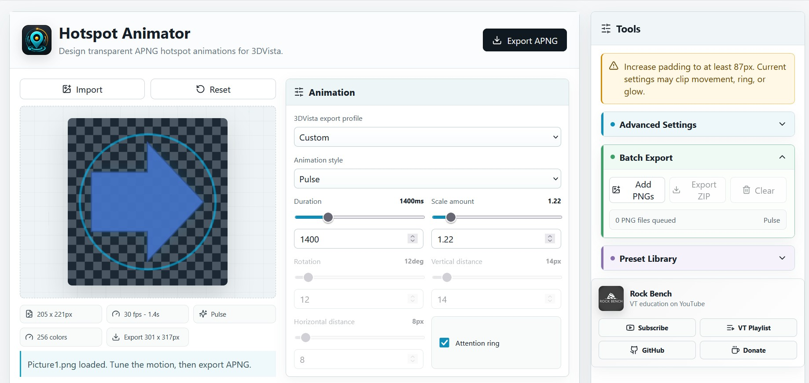
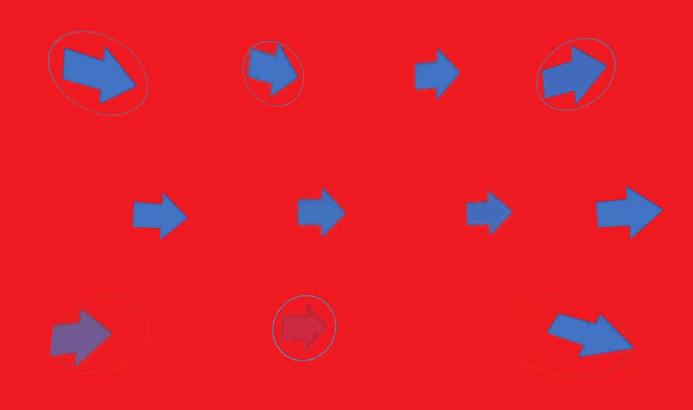
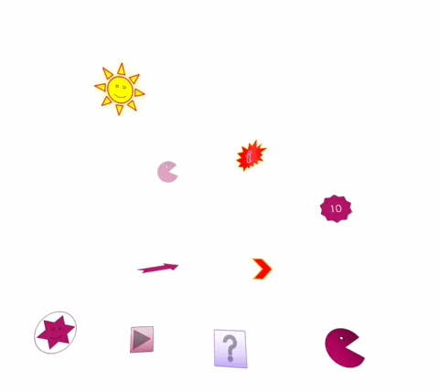

# Hotspot Animator

https://ahmadmehri.github.io/hotspot-animator/

Create 3DVista-friendly animated hotspot graphics from a transparent PNG.

Hotspot Animator is a simple desktop-style web app for virtual tour creators who want to turn static hotspot icons into attention-grabbing APNG animations. Import a PNG, choose an animation style, fine-tune the motion, preview it live, and export an animated PNG that can be used in 3DVista as a hotspot graphic.



## Sample Animation


## Why APNG?

3DVista hotspot graphics need to remain practical for tour projects: transparent background, easy import, and good browser compatibility. Hotspot Animator focuses on APNG because it keeps PNG-style transparency while supporting frame animation.

The app exports `.apng` files using PNG/APNG encoding, so the result is still an animated PNG file.



## Beginner Step-by-Step Guide

This section is for users who are not familiar with coding tools.

### Step 1: Install Node.js

Hotspot Animator needs Node.js to run on your computer.

1. Go to [https://nodejs.org](https://nodejs.org).
2. Download the **LTS** version.
3. Install it with the default settings.
4. After installation, restart your Command Prompt or PowerShell window.

### Step 2: Download the Project

If you are using GitHub:

1. Open the Hotspot Animator repository.
2. Click the green **Code** button.
3. Click **Download ZIP**.
4. Extract the ZIP file to a normal folder, for example:

```text
D:\Projects\Hotspot Animator
```

The folder can be anywhere on your computer. It does not have to be on the `C:` drive.

### Step 3: Open the Correct Folder

This is very important. You must run the commands inside the folder that contains `package.json`.

On Windows:

1. Open the Hotspot Animator folder.
2. Click the address bar at the top of File Explorer.
3. Type `cmd`.
4. Press **Enter**.

Command Prompt will open directly inside the project folder.

You should see a path similar to:

```text
D:\Projects\Hotspot Animator>
```

If you see only this:

```text
C:\Users\YourName>
```

you are in the wrong folder.

The exact drive letter and folder path may be different on your computer. That is okay. The important part is that the Command Prompt is opened inside the Hotspot Animator project folder.

### Step 4: Install the App Files

Run this command:

```bash
npm install
```

This downloads the required app dependencies. It may take a little while.

### Step 5: Start Hotspot Animator

Run this command:

```bash
npm run dev
```

After a moment, you should see a local address like:

```text
http://localhost:5173/
```

Copy that address and open it in your browser.




## Features

- Import transparent PNG hotspot icons.
- Live canvas preview of the selected animation.
- Export animated PNG/APNG files.
- Batch export multiple PNG files as a ZIP.
- 3DVista export profiles for small, medium, large, VR-safe, high-attention, and low-file-size use cases.
- Tour-friendly warnings for heavy animations, large dimensions, strong movement, strong rotation, and possible clipping.
- Clipping warning with padding guidance.
- File size optimization modes: Quality, Balanced, Small File, Tiny File, and Custom Colors.
- Preset system with factory presets and user presets.
- Preset import/export as JSON.
- Short tooltips across the interface.
- Rock Bench YouTube, VT playlist, GitHub, and donation links in the Tools panel.

## Animation Styles

Hotspot Animator includes a wide collection of safe hotspot animation styles:

- Beacon
- Blink
- Bounce
- Breathe
- Breathing Ring
- Click Me Ripple
- Compass Nudge
- Double Pulse
- Elastic
- Far Zoom In
- Flash Glow
- Float
- Float Diagonal
- Float Horizontal
- Focus Halo
- Glow
- Grab Attention
- Heartbeat
- Magnet Pop
- Orbit
- Ping Double Ring
- Pop
- Pulse
- Radar Ring
- Ring Draw
- Ring Draw Reverse
- Rubber Band
- Shimmer
- Slide
- Slide Down
- Slide Left
- Slide Right
- Slide Up
- Soft Lift
- Spin
- Sweep Glow
- Swing
- Tilt Pulse
- Tremble
- VR Gentle Pulse
- Wiggle
- Wobble
- Zoom Spin

## User Controls

The app exposes the important animation settings without requiring manual frame editing:

- Duration
- FPS
- Delay
- Padding
- Export scale
- Scale amount
- Minimum opacity
- Rotation
- Vertical distance
- Horizontal distance
- Easing
- Glow color, blur, and opacity
- Attention ring color, thickness, start size, expansion, and opacity
- Preview background
- Export filename
- File optimization mode
- Custom APNG color limit

Controls that do not apply to the selected animation are disabled automatically.

## 3DVista Workflow

1. Create or choose a transparent PNG hotspot icon.
2. Open Hotspot Animator.
3. Click **Import** and select the PNG.
4. Choose a **3DVista export profile**.
5. Choose an **Animation style**.
6. Adjust movement, scale, ring, glow, and optimization settings.
7. Check warnings in the Tools panel.
8. Click **Export APNG**.
9. Import the exported `.apng` file into 3DVista as your hotspot graphic.

## Batch Export

Batch Export lets you apply the current animation settings to multiple PNG files.

1. Open **Batch Export**.
2. Click **Add PNGs**.
3. Add multiple transparent PNG files.
4. Click **Export ZIP**.
5. The app creates a ZIP containing animated APNG versions of the queued files.

## Presets

The preset system helps users save reliable animation recipes.

Factory presets include:

- Soft Pulse
- VR Subtle
- Strong Callout
- Horizontal Float
- Clean Radar
- Ring Draw
- Slide Right
- Slide Down

Users can also:

- Save current settings as a user preset.
- Apply a selected preset.
- Duplicate presets.
- Rename user presets.
- Delete user presets.
- Export user presets as JSON.
- Import preset JSON files.

## File Size Tips

Animated hotspots should stay lightweight, especially for mobile and VR tours.

- Use **Balanced** for most projects.
- Use **Small File** or **Tiny File** for mobile-heavy tours.
- Use **Quality** when gradients, shadows, or smooth glow are important.
- Lower FPS reduces file size.
- Shorter duration reduces frame count.
- Smaller export scale reduces dimensions.
- Large glow, ring expansion, and movement may require more padding and can increase file size.

### Step 6: Use the Software

1. Click **Import**.
2. Choose a transparent PNG hotspot image.
3. Select a **3DVista export profile**.
4. Choose an **Animation style**.
5. Adjust the animation settings if needed.
6. Check the warnings panel.
7. Click **Export APNG**.
8. Import the exported APNG file into 3DVista as your hotspot graphic.

### Step 7: Close the Software

When you are finished, go back to the Command Prompt window and press:

```text
Ctrl + C
```

Then type `Y` if it asks for confirmation.

### Common Beginner Problems

If you see this error:

```text
Could not read package.json
```

it means you ran `npm install` in the wrong folder. Open the folder that contains `package.json`, then run the command again.

If double-clicking `index.html` does not work, that is normal. Hotspot Animator is a React/Vite app and must be started with:

```bash
npm run dev
```

## Installation

Hotspot Animator is built with React, TypeScript, and Vite.

Important: do not open `index.html` directly by double-clicking it. This project needs a local Vite server because the browser must load React, TypeScript modules, and bundled assets correctly.

### Requirements

- Node.js
- npm

### Simplest Way to Run

```bash
npm install
npm run dev
```

After running the command, Vite will print a local URL, usually:

```text
http://localhost:5173/
```

Open that URL in your browser.

### Development Server

Use this when editing or testing the app:

```bash
npm run dev
```

### Production Build

Use this when you want to check the final optimized version:

```bash
npm run build
npm run preview
```

Vite will print a preview URL, usually:

```text
http://localhost:4173/
```

### Why `index.html` Does Not Open Directly

Hotspot Animator is not a plain HTML file. It is a Vite React app. The root `index.html` loads the app through module paths such as `/src/main.tsx`, which must be served by Vite during development or by a production web server after building.

If you double-click `index.html`, the browser opens it with a `file://` path, and those module paths will not resolve correctly.

For local use, the simplest solution is always:

```bash
npm install
npm run dev
```

## Project Structure

```text
Hotspot Animator/
+-- src/
|   +-- App.tsx              # Main user interface
|   +-- animation.ts         # Animation styles and frame logic
|   +-- render.ts            # Canvas rendering and APNG export
|   +-- presets.ts           # Factory and user preset helpers
|   +-- tourProfiles.ts      # 3DVista profiles and tour warnings
|   +-- styles.css           # Application styling
|   +-- assets/
|       +-- hotspot-animator-icon-512.png
|       +-- hotspot-animator-icon.png
|       +-- rock-bench-logo.jpg
+-- public/
|   +-- hotspot-animator-icon.png
+-- index.html
+-- package.json
+-- package-lock.json
+-- tsconfig.json
```

## Tech Stack

- React
- TypeScript
- Vite
- UPNG.js for APNG encoding
- JSZip for batch ZIP export
- Lucide React for icons

## Notes

- Use transparent PNG files for best results.
- The preview background color is only for previewing transparent graphics; it is not baked into the exported APNG.
- The exported animation may need enough padding to avoid clipping large movement, glow, or ring effects.
- If an animation looks too aggressive inside a VR tour, try the **VR-Safe Subtle** profile or reduce rotation, movement, scale, and FPS.

## Rock Bench

Hotspot Animator is created by Ahmad Mehri from Rock Bench.

- YouTube Channel: [Rock Bench](https://www.youtube.com/@rockbench)
- Subscribe: [Direct subscription link](https://www.youtube.com/channel/UC6OwZWavuKkB1e7GN-9UA1g?sub_confirmation=1)
- VT Education Playlist: [YouTube playlist](https://www.youtube.com/playlist?list=PLtI1Arw9fM9S0Tga0Ir3j52GEBkUk3L7y)
- GitHub: [ahmadmehri](https://github.com/ahmadmehri)
- Donate: [Buy Me a Coffee](https://buymeacoffee.com/rockbench)

## License

No license has been added yet. Add a license before publishing if you want others to know how they may use, modify, or redistribute the project.
